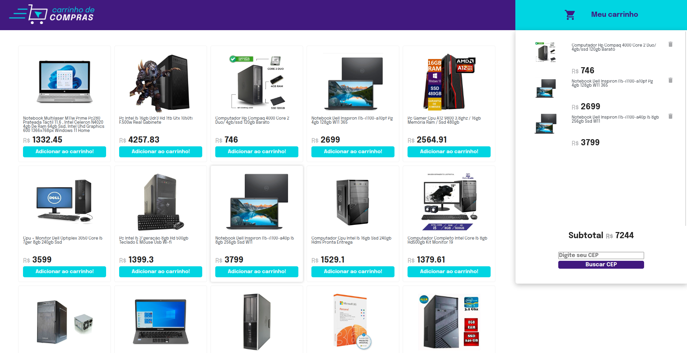

# Trybe - Shopping Card Project

Esse foi um projeto realizado em conjunto com a Trybe, empresa profissionalizante de desenvolvedores. Com o design oferecido por eles, desenvolvi funções e testes que simulam passos de uma compra online. Foram utilizadas uma API do Mercado Livre para buscar dados de produtos e uma API de CEP para pegar um endereço.

## Table of contents

- [Overview](#overview)
  - [O desafio](#o-desafio)
  - [Screenshot](#screenshot)
  - [Links](#links)
- [Meu processo](#meu-processo)
  - [Contruído com](#contruido-com)
  - [Continuação do desenvolvimento](#continuacao-do-desenvolvimento)
  - [Recursos Úteis](#recursos-úteis)
- [Autor](#autor)
- [Instalação](#instalação)

## Overview

### O desafio

Usuário devem conseguir:

- Adicionar e remover um item ao carrinho
- Pesquisar um CEP e receber o endereço na tela
- Verificar que os dados ao atualizar a página estão salvos no localStorage
- Atualização de valores ao adicionar ou remover um item

### Screenshot



### Links

- Solution URL: [My Solution](https://github.com/devmatias/shopping-cart-project)
- Live Site URL: [Live Site](shopping-cart-matiasdev.surge.sh)

## Meu processo

### Construído com

- HTML5 Semântico
- CSS 
- JavaScript
- Consumo de API


### Continuação do desenvolvimento

Nessa aplicação é possível continuar o desenvolvimento aplicando novas páginas para finalizar o processo de compra, entregar novos elementos com uma melhor expertiência para o usuário, consumir outras APIs.
O foco da aplicação foi o consumo de APIs e a disposição dos dados na tela. Pouco se olhou para o CSS em si. 

### Recursos Úteis

- [ChatGPT](https://chat.openai.com/chat) - Ferramente muito útil para qualquer tipo de dúvida.

## Author

- Linkedin - [Matias Correa Franco de Faria](https://www.linkedin.com/in/matias-correa-franco-de-faria-602b85171/)

## Instalação

Se quiser verificar o projeto em sua máquina, faça o download ou clone o repositório e depois aplique o comando no terminal:

```bash
npm install
```

Se algo der errado, cheque se as depêndencias estão atualizadas no arquivo 'package.json' e tente o comando novamente.
Assim você estára apto a rodar o projeto.